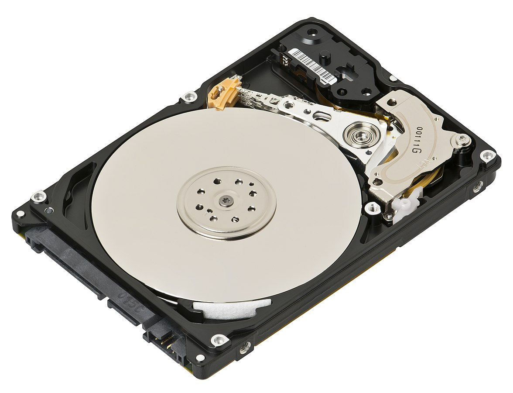
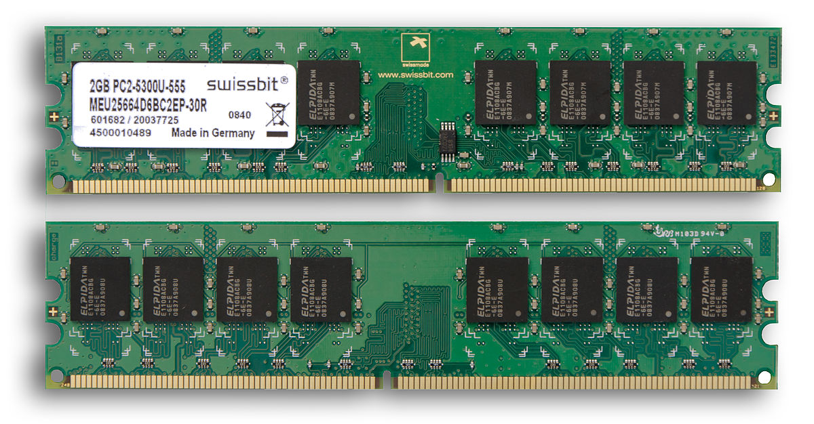
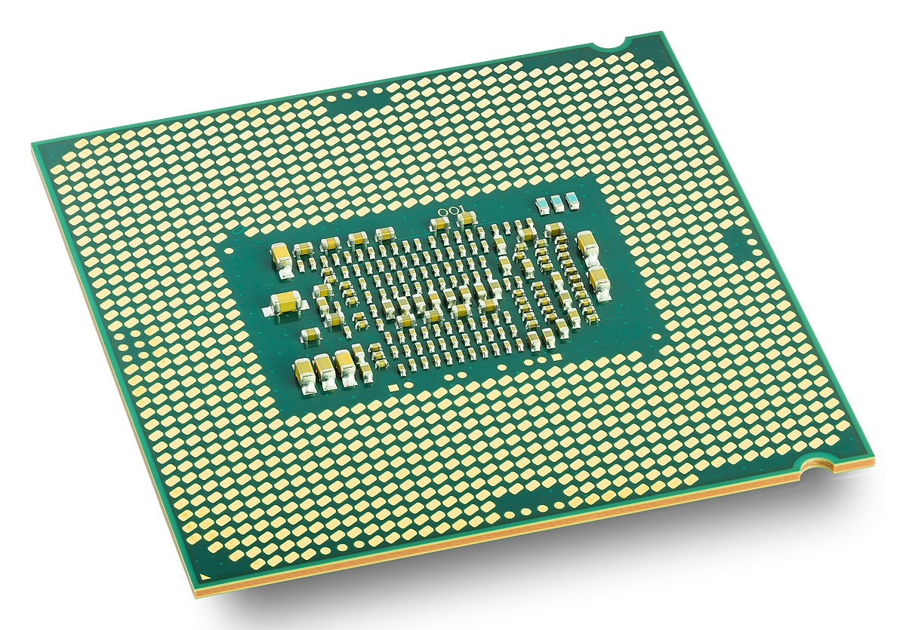
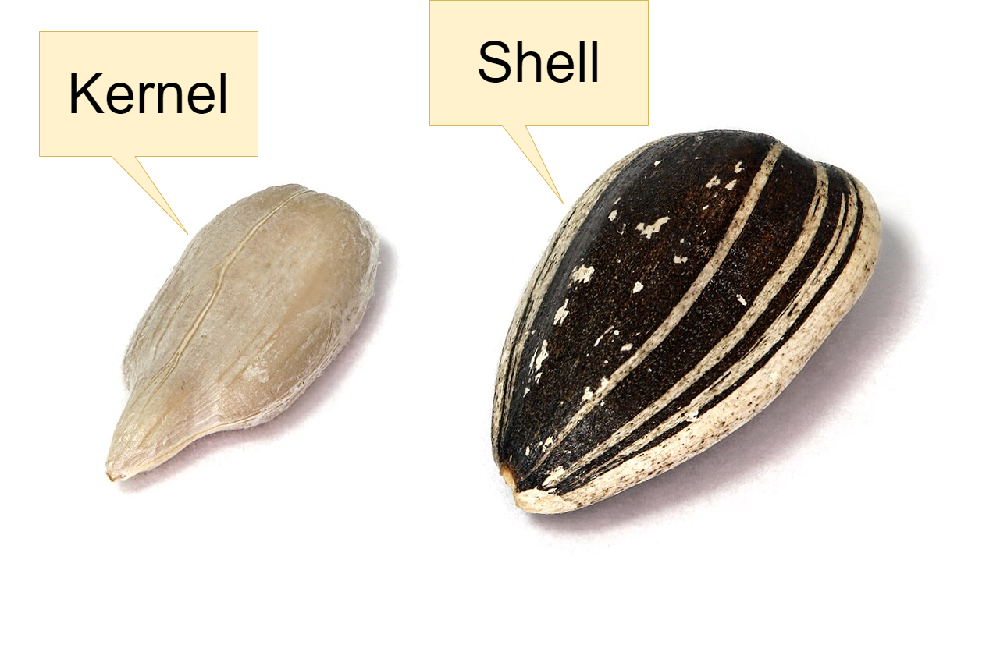
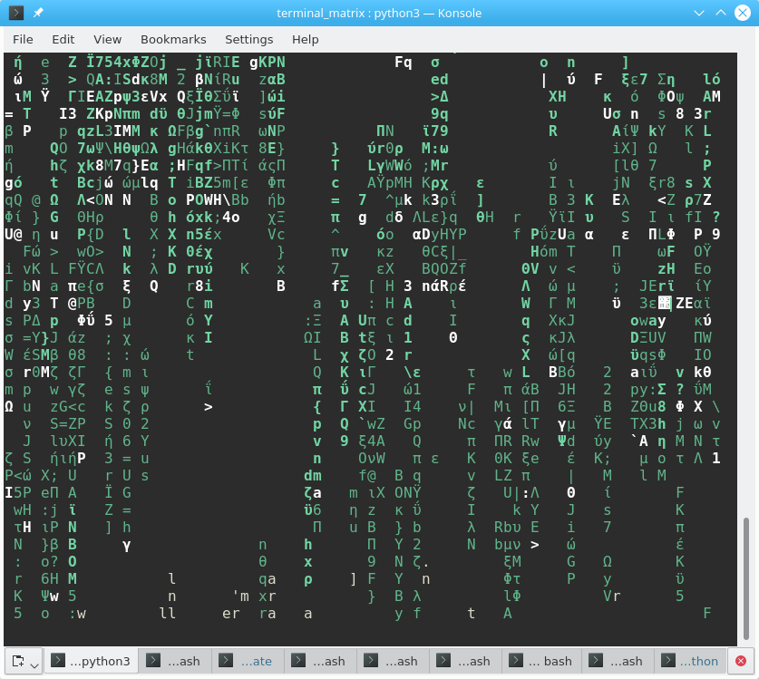
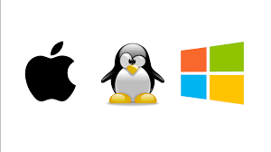
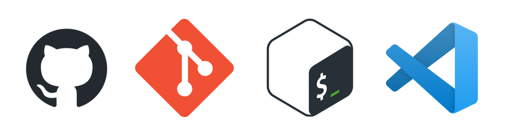
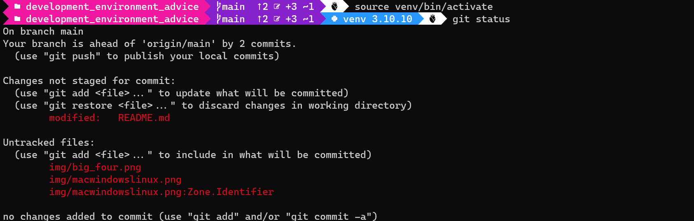

<h1>Checkpoint Talk: Operating Systems and Development Environments</h1>

<h2>With Oliver Lavers</h2>

Hi folks, I'm Oliver! Welcome to my She Codes Checkpoint Talk. This Github repo contains all the high-points from my talk, as well as any diagrams or code demos I used over the course of the evening.

In this talk I'll be discussing the following topics:

- [Why Give This Talk?](#why-give-this-talk)
- [What Is A Development Environment?](#what-is-a-development-environment)
- [Operating Systems - What Do Developers Need To Know?](#operating-systems---what-do-developers-need-to-know)
  - [How Computers Work](#how-computers-work)
    - [The Hard Drive](#the-hard-drive)
    - [RAM](#ram)
    - [The CPU](#the-cpu)
  - [The Operating System](#the-operating-system)
    - [The Kernel](#the-kernel)
    - [The Shell](#the-shell)
      - [The Terminal](#the-terminal)
- [Development Environment Management - Why Bother?](#development-environment-management---why-bother)
  - [Reproducibility](#reproducibility)
  - [Dependency Management](#dependency-management)
  - [A Smoother Path](#a-smoother-path)
- [Important Factors in Dev. Environment Choice](#important-factors-in-dev-environment-choice)
  - [The Big Three: Do I Need To Pick An OS?](#the-big-three-do-i-need-to-pick-an-os)
  - [Programming Goals](#programming-goals)
- [Industry Standards](#industry-standards)
- [What You Need To Get Started](#what-you-need-to-get-started)
  - [Terminal](#terminal)
  - [Shell](#shell)
  - [Editor](#editor)
  - [Version Control](#version-control)
  - [Dependency Management](#dependency-management-1)
    - [For Python](#for-python)
    - [For Javasript](#for-javasript)
    - [For Others](#for-others)
  - [Peripheral Tools](#peripheral-tools)
    - [Text Editing](#text-editing)
    - [Diagramming](#diagramming)
    - [Document Creation](#document-creation)
    - [Project Management](#project-management)
    - [Data Analysis/Dashboarding](#data-analysisdashboarding)
- [Paths To Becoming A Dev. Environment Blackbelt](#paths-to-becoming-a-dev-environment-blackbelt)
  - [Dev Environment Upgrades](#dev-environment-upgrades)
  - [Becoming Multilingual](#becoming-multilingual)
  - [Computer Science Theory](#computer-science-theory)

## Why Give This Talk?
This might seem like a lot of info to get through about if you're just getting into coding, but trust me - this is what I wish I had known before I ever set finger to keyboard. 

It might also seem like these are two pretty separate topics. In fact, they are tightly bound to one another. When you are making decisions about how to set up your development environment, an understanding of the operating system can be crucial.

A little bit of background here can give you the context you need to launch yourself into the most intimidating parts of coding with gusto. The path to being a blackbelt hacker doesn't have an end, but this is a good way to begin!

Given that, the goals of this talk are twofold:
- Describe how your operating system impacts your development environment
- Give some advice on getting set up and improving your skills

Caveat: the ideas set out here are my opinion. You'll develop your own preferences and standards as you learn!

> Actual footage of you on your journey to programming glory.

## What Is A Development Environment?
Your development environment is the collection of all the tools that come together on your computer to help you write code. This includes:
- the computer itself, and it's operating system
- programs that allow you to run your code
- programs that you use for writing code
- any tools that help you improve your work
- etc, etc...

This makes your development environment setup a vital part of learning to program, but it's also a very hard part to get right! I've put this talk together to try and help new developers understand what they need, and what their options are.

## Operating Systems - What Do Developers Need To Know?
### How Computers Work
> Yep, we are getting down to the really tricky bits right away.

There's an extent to which the theory of computer science actually gets in the way of understanding how this stuff works. The field has turned into a very abstract branch of engineering, which means that the hidden secrets of IT are quite divorced from the point at which the rubber meets the road.

For instance, we often hear that computers run on binary code - `1`'s and `0`s. This is 100% true, and also **100% useless** when it comes to the practical work that a beginner can engage with.

Here's a better explanation:

Seriously. Just imagine for a moment that there are elves inside each component of the computer, and they do what they're told to on command. It simplifies the discussion, and it really doesn't give you any less information.

Let's take a look at some of those components:

#### The Hard Drive

This element is used for long term storage of information. It's the computer equivalent of long term memory. Files live here, and are made up of text or binary data.

#### RAM

> (AKA - **R**andom **A**ccess **M**emory)

This element is used for short-term storage of information. The computer equivalent of short-term or working memory. This is where the variables we use in our code are stored while our programs are running.

#### The CPU

> (AKA - **C**entral **P**rocessing **U**nit)

This element is the computer equivalent of a frontal lobe. It is the physical part of the hardware that can manipulate information. 

It doesn't independently know *how* it should manipulate information, though. On its own it would just sit there like a big chunk of inanimate silicon. 

To do anything useful it needs some secret sauce...

### The Operating System

> (AKA - "**OS**")

This element is software, not hardware. It's a the most fundamental program that your computer knows how to run.

The operating system is stored on the hard drive. Every time the computer is turned on, it immediately gets loaded into the CPU, and starts telling it how to be a computer. 

The operating system tells the CPU how to find your files, what to display on the screen, how to understand the other programs, and how to respond to your requests. 

This means that everything else that happens on your computer has your operating system as its foundation. Any program that runs on your machine needs to be crafted to fit your particular operating system, and the ways that you can interact with the computer will be governed by the operating system's specifications.

The operating system is broken up into two major components, using the metaphor of a seed...

#### The Kernel

> Artist's impression only...

The kernel is the core of the OS. It interacts with all the various components of the computer, speaking in their language. It talks to your monitor the way a monitor is capable of understanding. It speaks keyboard-language to your keyboard. It corrals the memory and the CPU and all the other bits and pieces.

I've represented the kernel up there as an otherworldly being, because it isn't really designed to be comprehensible by human beings. It is designed to be terrifyingly efficient, and to be comprehensible by computer hardware.

Thats why we need...

#### The Shell

The shell is the outer wrapper of the OS. It acts as a translator between the user and the kernel, making it easy to tell the computer what to do. 

The user hands instructions to the shell. The shell translates them into something the kernel can understand. Then the kernel goes and musters all the resources of the computer to try and deliver what the user asked for.

Most of the time you can actually pick and choose between a variety of shells that are designed to work with your operating system, and picking your shell is one of the important aspects of setting up a development environment.

So, where can we find the shell to talk to it?

##### The Terminal 

The terminal is a text input/output program that lets you talk to your shell. 

Because you very seldom interact with the shell except through the terminal, it's easy to get them confused. In fact, a lot of popular shells come bundled with their own terminal.

Just keep in mind, behind the scenes and under the hood, they're separate, and that means that you can often use the same terminal to interact with a variety of different shells!

## Development Environment Management - Why Bother?
Ok, that was a lot. So how does it motivate us to think about dev. environments?

Well, think about this: there are a bunch of different operating systems out there. That means that every developer's computer has its own quirks and specific circumstances. And *that* means that each developer needs to learn how best to work with the operating system that they are using.

In particular...

### Reproducibility
We need a way to make sure that the code that runs on our development machine will run on other people's machines! After all, what's the point of writing a program that nobody can ever use?

If you're making websites, you need to make sure that your websites can be served from a Linux machine, because that's probably what will be serving them when you deploy them.

If you're writing desktop apps, you need to make sure that your desktop interacts with your programs the same way that your users' machines will.

And if you're coding in a team, you need to make sure that you are producing work that your colleagues can make use of on their own machines. 

### Dependency Management
As you start building things, you'll inevitably pull in more and more tools to do so. Some of your projects will require these tools in order to work at all. If you aren't careful, these can really pile up on you.

An unmanaged development environment can result in some pretty chaotic messes, with version conflicts, broken deployments, and more. Going in with a clear idea of what you're going to use and how you're going to use it can do a lot to prevent these errors.

### A Smoother Path
A lot of other people have struggled their way through the challenges of being a junior developer before. 

Each one of them has helped carve the path out, by running up against problems and errors, and either finding a solution themselves, or asking online for help.

If you follow a commonly accepted toolchain progression, you will benefit from the collective wisdom of all the programmers who came before you!

## Important Factors in Dev. Environment Choice
### The Big Three: Do I Need To Pick An OS?

You might be asking yourself, "Don't you mean the big two? What is Linux doing in there?"

In fact, Linux is the top dog when it comes to programming. In most cases, Linux is the gold standard operating system that we need our code to run on. Mac and Windows are competing for second place, and they're actually in pretty close competition, relatively speaking. The only exceptions to this are if you're writing code that is meant to *exclusively* run on either Windows or Linux, but that's honestly not that common in the field.

Really, the reason we are using Windows and Mac at all is just that they are often a lot more convenient day-to-day. We don't want to have to be hackers just to read our emails. 

This means that the ultimate goal is to try and converge on an environment that is:
  - similar to what your colleagues are using
  - able to emulate Linux enough to be useful
  - easy to use and powerful!

HOWEVER, when you're first starting out, there's a huge amount of information and systems to onboard to achieve that goal. Rather than trying to leap all the way to a final state, I recommend moving in stages. Baby steps towards the final goal.

One thing I **won't** tell you is "if you want to be a programmer, you need to buy brand X". As long as you have a laptop or desktop that works, is relatively recent, and has an up-to-date operating system, you can be a programmer. Mac or Windows, both will work.

### Programming Goals
The next question you have to ask yourself is: "what sort of developer do I want to be"? 

This won't make a big difference right away, but it will inform what path you go down once you get some more knowledge under your belt.

- **Want to be a Web Developer?** You're eventually going to need API platforms like Insomnia or Postman, wireframing tools, UML capabilities, database management systems, etc...
- **Want to get into data analytics/science?** You'll need notebooks, visualisation tools, pipelining capabilities, modelling, etc...
- **Planning on becoming an app developer?** That's going to require testing tools, build tools, distribution platforms, SDKs, etc...
- **Got your eye on devops?** That means CDKs, containerisation, automation, storage, and secrets managers, etc...
- **Interested in security?** You're looking at VMs, fuzzers, packet capture, Kali Linux, the Burp Suite, and more...

If you're just this second starting out, this is an intimidating list, but it's good to have this on your horizons so you know what to research. Odds are, you'll have these tools called to your attention once you start learning, and you will be able to slot them into your utility belt one by one.

So what do you need right now, if you're setting up your environment for the first time *today*?

## Industry Standards

There are some tools that are so fundamental that everyone should know about them them. I'm not saying that everyone should *use* these fundamental elements all the time, but having access to them is a major boost to your coding power, productivity, and knowledge.

These are tools that programmers all over the world can instantly recognise, and that means that if you fold them into your practise, you'll be making your work interoperable with the work done by a global web of other geniuses.

## What You Need To Get Started
### Terminal
At least a passing familiarity with the terminal is a **giant** power multiplier. 

This is a part of programming that can be *extremely* intimidating, but I promise it is actually simpler than using a regular graphical user interface (GUI). The trick is just to remember that a picture tells a thousand words. Is the terminal displaying a giant wall of confusing text to you right now? That's ok - you've seen more complicated errors from the GUI before a million times, it's just that they were displayed as images. Read the text, google it if you have to; it's probably saying something simple.

On Windows I recommend Windows Terminal as the terminal of choice - it's relatively new. If you want something a little more pared back, you can use the terminal that comes bundled with Git Bash.

On Mac, the regular built-in terminal is just fine, it's just not as pretty as Windows Terminal can be:

> It took some work for me to get it looknig this way, but check it out! Windows Terminal is awesome.

### Shell
You'll need a shell to use in your terminal. 

Hot take: the shells that come bundled with Windows (Cmd and Powershell) both less than ideal. This is a major problem with Windows - under the hood it's quite different to Linux, so it takes some work to get things working the way you'd expect. Often, the commands in the built-in shells are different, and installation doesn't go the way you'd expect. 

This means that for Windows, I recommend Git Bash at the shell of choice. At the very least, it means that most of the commands work the same as they do in Linux/Mac. It can be a tiny bit more effort to get working, but it's worth it. 

> Once you've got a few months of experience under your belt, try getting the Windows Subsystem for Linux (WSL2) up and running, and after that you can use the Bash shell in Ubuntu Linux, from the comfort of your Windows machine.

On Mac, the bundled shell (Zsh) works just fine.

### Editor
VS Code is the editor I recommend to all new programmers. Accept no imitators! It has some excellent addons and I use it for everything.

### Version Control
It's gotta be Git, no question about it. Git is key, and everyone should use it for everything.

### Dependency Management 
#### For Python

#### For Javasript

#### For Others

### Peripheral Tools
#### Text Editing

#### Diagramming

#### Document Creation

#### Project Management

#### Data Analysis/Dashboarding

## Paths To Becoming A Dev. Environment Blackbelt
### Dev Environment Upgrades

### Becoming Multilingual

### Computer Science Theory